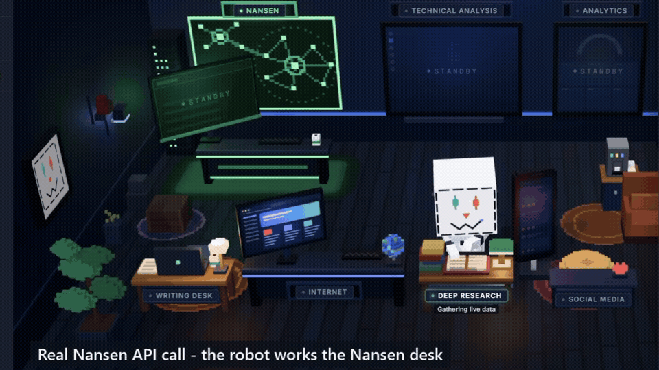
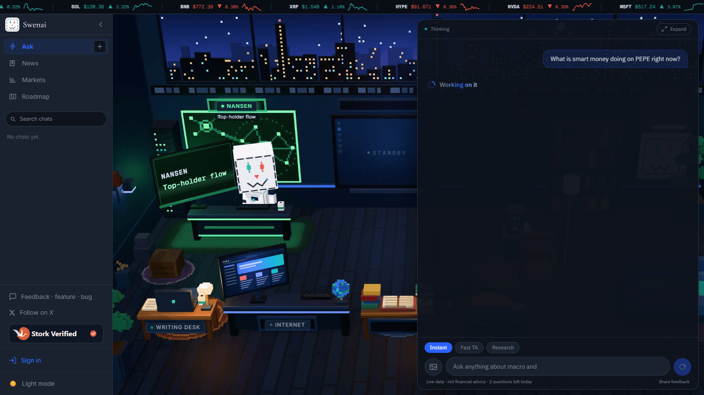
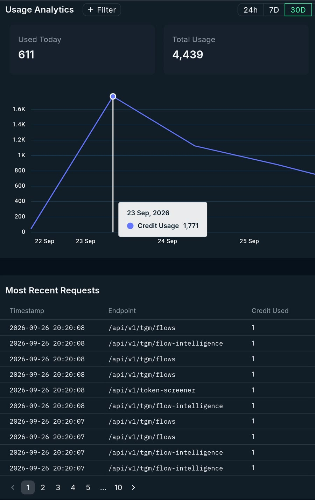
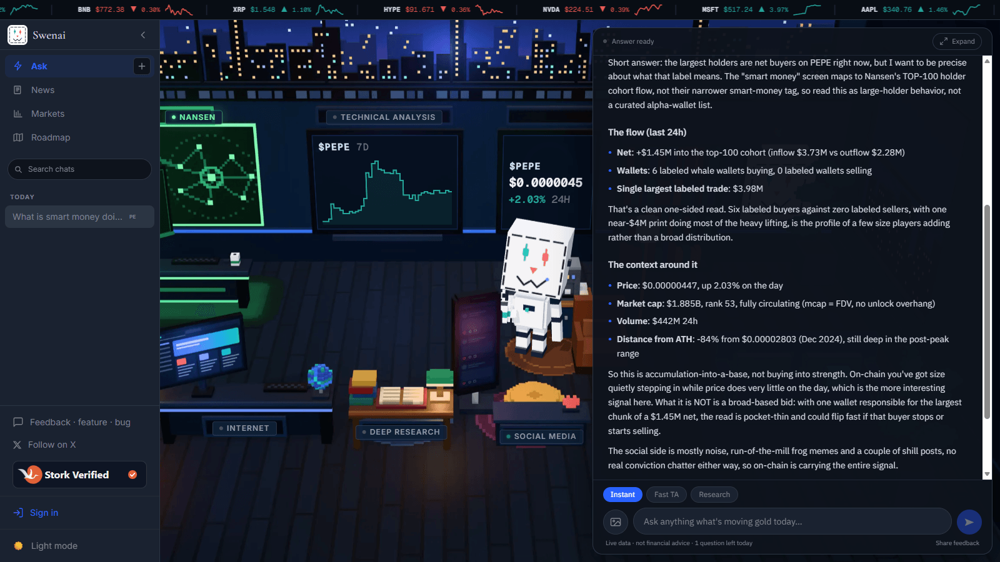
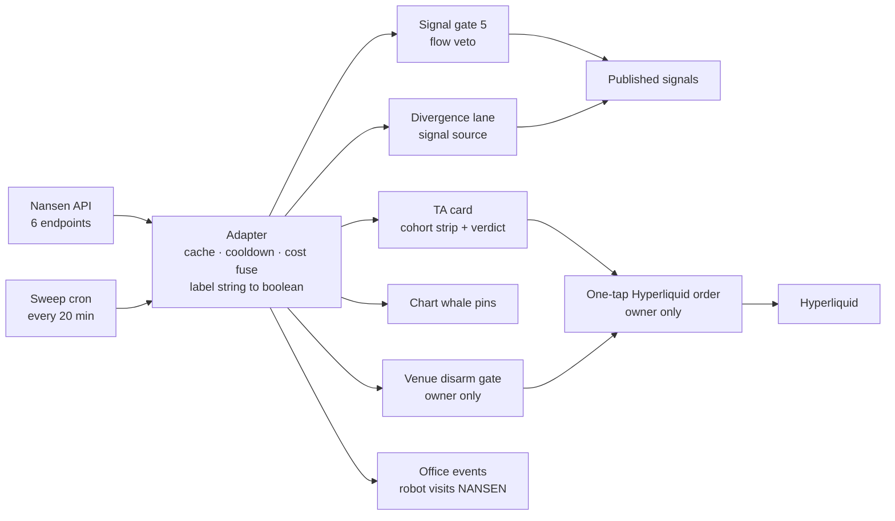

<p align="center">
  <picture>
    <source media="(prefers-color-scheme: dark)" srcset="docs/nansen-hero-dark.webp">
    <source media="(prefers-color-scheme: light)" srcset="docs/nansen-hero-light.webp">
    
  </picture>
</p>

<h1 align="center">Swenai x Nansen</h1>

<p align="center"><b>Smart money gets a veto.</b><br>
On-chain flow that decides, not decorates: Nansen data that sources trade signals,<br>
overrules the chart, and refuses to arm a Hyperliquid order when smart money on Hyperliquid is on the other side.</p>

<p align="center">
  <a href="https://getswenai.com"><b>Live app: getswenai.com</b></a> &nbsp;·&nbsp;
  <a href="https://x.com/josephweb3/status/2103788169401651505"><b>55 s demo video on X</b></a> &nbsp;·&nbsp;
  <a href="#try-it-in-under-10-minutes">Run it</a> &nbsp;·&nbsp;
  <a href="#how-it-maps-to-the-judging">Judging map</a>
</p>

<p align="center">
  
</p>
<p align="center"><sub>From the demo video, on getswenai.com: a real Nansen read in the office, then Nansen whale trades pinned on the chart.</sub></p>

**Requirements at a glance**

| Buildathon requirement | Where to check |
|---|---|
| Built on the Nansen API | Six endpoints in production on getswenai.com, [listed here](#1-data-integration-nansen-data-drives-the-logic) |
| 1,000+ API calls | [How to verify them](#1000-calls-and-how-to-verify-them) |
| 30 to 60 s demo video and X post | [The 55 s demo on X](https://x.com/josephweb3/status/2103788169401651505), tagging @nansen_ai (the GIF above is cut from it) |
| Public repo another builder can run | One command, about 5 s once you have a key: [run it](#try-it-in-under-10-minutes) |

---

## In 30 seconds

[Swenai](https://getswenai.com) is a live crypto trading assistant with real users. It executes on
[Hyperliquid](https://hyperliquid.xyz), a perpetuals exchange. This repo is its
[Nansen](https://www.nansen.ai) layer, where Nansen's wallet-labeled on-chain data makes four decisions:

| # | Nansen decides | Endpoint | What changes |
|---|---|---|---|
| 1 | **Who is really buying** | `/tgm/flow-intelligence` | Splits the same 24h flow into six wallet cohorts. "Retail bidding while smart money exits" is a read that a single net-flow number shows as bullish. |
| 2 | **Which signals exist** | `/token-screener` | Finds tokens smart money is buying *while price falls*. Those become candidates in a signal lane that a chart alone could not produce. |
| 3 | **Which signals die** | `/tgm/flows` | For DEX-listed candidates (untracked coins in the trending and divergence lanes), a long into more than $250K of 24h net top-holder outflow is never published. |
| 4 | **Whether the trade button arms** | `/smart-money/perp-trades` | Before a one-tap Hyperliquid order, it checks which way smart money is positioned *on Hyperliquid*. If they are against you, the button refuses. |

Most smart-money tools tell you what to copy. Swenai uses the same data to tell you when **not** to trade.

And because an agent's work is invisible, the Ask screen is now **the office**: a voxel trading desk where
the Swenai robot walks to the station of every real tool the agent uses. It visits the NANSEN desk only
when a real Nansen read happens.

<p align="center">
  
</p>

---

## Try it in under 10 minutes

One command, zero dependencies, no build step. It walks through the same Nansen calls Swenai makes for a
real trade decision and ends on the decision itself.

**You need:**

1. **Node.js 18 or newer** (macOS, Linux or Windows). Check with `node --version`.
2. **A Nansen API key.** Sign in at [app.nansen.ai/api](https://app.nansen.ai/api) and create one
   (the Buildathon page says "Free to start"). A new free key comes with trial credits: ours showed
   100 on sign-up. One demo run costs **9 credits** (five calls, four at 1 credit and one at 5),
   so a free key covers about 11 runs.

### macOS / Linux

```bash
git clone https://github.com/josephlacsamana/swenai-nansen
cd swenai-nansen
export NANSEN_API_KEY=paste-your-key-here
node demo.mjs PENGU
```

### Windows (PowerShell)

```powershell
git clone https://github.com/josephlacsamana/swenai-nansen
cd swenai-nansen
$env:NANSEN_API_KEY = "paste-your-key-here"
node demo.mjs PENGU
```

In `cmd.exe`, use `set NANSEN_API_KEY=paste-your-key-here` instead. No git? Use **Code > Download ZIP** on this page.

**Prefer a file?** Run `cp .env.example .env` and put the key after the `=`: `NANSEN_API_KEY=abc123`.
The loader reads UTF-8 with or without a BOM, UTF-16 (what PowerShell 5.1's `>` writes), CRLF line
endings and quotes around the value. The environment variable always wins over `.env`.

Other tickers: `node demo.mjs BONK`, `WIF`, `PEPE`, `ETH`. Any ticker with a DEX market on a chain Nansen
covers works. PENGU and these four have pinned canonical addresses, so they resolve even if DexScreener is down.

### Measured on a fresh clone

| Step | Time |
|---|---|
| `git clone` | under 2 s |
| `node demo.mjs PENGU` | 5.2 s, exit code 0 |
| Creating a Nansen key, if you don't have one | a few minutes |

Measured on 2026-09-26 on Windows 11 with Node 24, in both PowerShell 5.1 and Git Bash, using the commands above.

### What you will see

The output is **live**, so your numbers will differ. This is a real run, PENGU, 2026-09-26 (trimmed):

```text
  Swenai x Nansen - decision walkthrough for $PENGU
  Nansen data does not render as a dashboard here. It decides.

─── 1. RESOLVE
  PENGU on solana · $0.009984 · liquidity $4.35M · 24h vol $5.84M

─── 2. THE NUMBER MOST TOOLS SHOW YOU
    → call 1: /tgm/flows
  Top-100 holder flow, 24h: +$431K net
    in $1.56M / out $1.13M · 100 holders

─── 3. WHO IS ACTUALLY ON EACH SIDE
    → call 2: /tgm/flow-intelligence
  Verdict: RETAIL BID, SMART EXIT

    Fresh wallets          +$769K
    Exchanges              +$288K
    Whales                  -$40K  9 wallets

    Fresh money is buying while the smart cohorts sell.
    A single net-flow number renders this as bullish. It is distribution.

─── 4. THE LARGEST TRADES (these get pinned to candles on the chart)
    → call 3: /tgm/dex-trades
  The 100 largest DEX trades of the last 7 days · 47 buys / 53 sells
    2026-09-21 18:55  BUY       $188K  (labeled wallet)

─── 5. THE VENUE THE ORDER WOULD LAND ON
    → call 4: /smart-money/perp-trades
  Smart-money positioning on Hyperliquid, PENGU, last 72h: balanced.

─── 6. THE DECISION
  TRADE DISARMED for a long on PENGU:
    · cohort flow shows retail bidding into smart-money exits

─── 7. WHAT A CHART CANNOT SEE: smart money buying while price falls
    → call 5: /token-screener
    RAY        solana    price -4.6%   smart money +$295K   mcap $529.71M
    FP         ethereum  price -11.8%   smart money +$80K   mcap $25.27M

  5 Nansen API calls this run  ·  96,720 credits remaining
```

**That is the thesis in one run.** The headline number says +$431K of buying. The cohort split says fresh
wallets did the buying while the smart cohorts sold on net, which is distribution, so the demo objects to a
long. A dated capture from 2026-09-23 read the same way, with bigger numbers that won't reproduce today:
+$801K of headline buying, whales at -$239K, verdict `RETAIL BID, SMART EXIT`.

**When does it disarm?** In the demo, section 6 objects to a long when the cohort verdict is
`RETAIL BID, SMART EXIT` or `SMART DISTRIBUTION`, or when smart money on Hyperliquid is `net short`.
Otherwise it prints `NO NANSEN OBJECTION`. Flows change hour to hour: an earlier PENGU run on the same day
read `MIXED` and had no objection, and both results are correct. In the live app the cohort verdict is shown
on the TA card and weighed in the trade judgment, and only the Hyperliquid read (section 5) disarms the
one-tap button.

`node scripts/count-calls.mjs` prints your key's remaining credits and the per-endpoint cost table. It uses the
same key and makes one 1-credit call. (`npm run calls` does the same, but Windows PowerShell's default policy blocks
`npm`; there, use `npm.cmd run calls`.) With no key, or if the call fails, it prints the same kind of message as the demo and exits 1.

---

## How it maps to the judging

The Buildathon judges four things at 25% each. Here is where each one lives.

### 1. Data Integration: "Nansen data drives the logic"

Six Nansen endpoints run in production. Five of them feed a decision: a verdict, a veto, a new signal or a
disarmed button. The sixth, `/tgm/dex-trades`, pins the whales' trades to the candles they printed in.

| Endpoint | Credits | Cache | What it decides on getswenai.com | In `demo.mjs` |
|---|---|---|---|---|
| `/tgm/flow-intelligence` (`timeframe: "1d"`) | 1 | 15 min | Six-cohort strip and verdict on every TA card; an input to the trade judgment; the office's per-answer token read | section 3 |
| `/tgm/flows` (`label: "top_100_holders"`) | 1 | 15 min | Top-holder flow line on the TA card; **signal veto** for DEX-listed candidates (untracked coins in the trending and divergence lanes): a long into more than $250K of 24h net outflow is never published, and a short into the same inflow isn't either | section 2 |
| `/tgm/who-bought-sold` | 1 | 15 min | Counts of labeled wallets buying vs selling. The label string is reduced to a boolean in the adapter. | no |
| `/tgm/dex-trades` (`per_page: 100`) | 1 | 15 min | Whale buy and sell pins on chart candles (the 12 largest in view, for signed-in users) | section 4 |
| `/token-screener` (the divergence query) | 1 | 10 min | **Sources** the divergence signal lane; powers the agent's `find_smart_money_divergence` tool; the office's market-wide pulse | section 7 |
| `/smart-money/perp-trades` (72h) | 5 | 20 min | **Venue disarm**: one word (net long, net short or balanced) that arms or disarms the owner's Hyperliquid trade button | section 5 |

**The decision check reads Nansen too.** On each TA card, the live app sends the drawn plan (or, for a
no-trade verdict with no parked order, an entry at the current price), the chart's momentum facts, and the
Nansen top-holder net flow and six-cohort split to Jev, TypeSafe's decision model (`jev-latest`). Jev returns
a calibrated chase risk and setup quality, or a stand-aside score when there is no plan, shown on the card as
the "Decision check". It is advisory and never blocks the button, it does not read Deep Research reports, and
if it errors or times out the card ships without it.

#### 1,000+ calls, and how to verify them

The only number that counts is Nansen's own usage page for
the key behind getswenai.com (app.nansen.ai/api, usage analytics).

<p align="center"></p>
<p align="center"><sub>Nansen's usage analytics for our key, 30-day view, 2026-09-26: 4,439 credits. Every endpoint we use costs 1 credit per call except <code>/smart-money/perp-trades</code> (5).</sub></p>

Our own server-side counter tallies every 2xx Nansen response. Non-2xx responses are counted separately
as failures; timeouts and network errors are not counted at all. It read **1,131 successful calls** for
September on 2026-09-26 at 12:28 UTC. It can undercount under concurrent load, so treat it as a floor.
The calls come from the running product (TA cards and agent answers, the office, the hourly signal
generator), plus a sweep cron every 20 minutes that warms the cache and snapshots flow history:

- **TA cards and agent answers.** Every TA card for a token with a liquid on-chain market on a covered chain
  reads its top-holder flow, its cohort split and who bought or sold.
- **The office.** The office adds at most one real, cached read of its own to each answer, on top of any
  reads the agent's tools make. There is none for a rate-limited ask, with no key, during a cooldown or
  outside the office screen, and a token read that comes back empty does not fall back to another read.
- **The hourly signal generator.** It uses the flow veto and the divergence lane.
- **The sweep cron.** It rotates through live-signal coins, trending coins and the majors, six per tick.
  It snapshots flow history because the `/tgm/historical-*` endpoints return 404 on our plan. Our
  snapshots are the history.

### 2. Creativity: "We've seen dashboards. Show us something we haven't."

Nothing in Swenai is a Nansen dashboard. The data is wired into places where it can say **no**.

- **It vetoes our own signals** (`production/01`). Every auto-generated signal has to clear the lane gates:
  a perp listing, a zone with at least two touches, higher-timeframe alignment, a news veto, and the
  Nansen flow veto. The flow veto keys on the token contract, so it runs on DEX-listed candidates
  (untracked coins in the trending and divergence lanes); the BTC and bluechip lanes and tracked coins
  skip it. It is one-directional by design: missing data **passes**, because a veto must never become a dependency.
- **It originates signals** (`production/02`). The divergence lane starts from Nansen, not from a chart:
  smart money buying into weakness. Every candidate then faces the same deterministic zone engine and
  the same lane gates. On-chain proposes, TA disposes. It runs longs only, because the lane's whole thesis is buying.
- **It disarms the trade button on the venue the order would land on** (`production/03`). Swenai executes
  on Hyperliquid, and Nansen tracks smart-money perp trades on Hyperliquid. So the flow that informs the call
  and the book the order lands in are the same market. If smart money is positioned against your side,
  the card says so instead of arming:

  > **Trade disarmed:** smart money on Hyperliquid is net short this coin, against your LONG. Powered by Nansen API.

  You can override it, but then the order is yours, not the agent's.
- **The office makes it visible** (`production/05`). The Ask screen is a fullscreen voxel trading desk
  with seven labeled stations. The NANSEN station on the left always glows green. The robot walks to a
  station only when the server streams a real event for that step. For Nansen that means a request
  actually going out, or real Nansen data coming back from the cache. It never fires on a timer or because
  a tool's name mentions smart money. Each Nansen read runs inside its own `AsyncLocalStorage` scope, so
  parallel tool calls never hear each other's reads.

<p align="center">
  
</p>
<p align="center"><sub>A real production answer on 2026-09-26: "What is smart money doing on PEPE right now?" The robot went to NANSEN (smart-money pulse), then analytics, then NANSEN again (top-holder flow), then social, then writing.</sub></p>

### 3. Workability: "Live data loads. End to end. No crashes."

- **This repo:** zero dependencies and no build step. It uses Node 18+ built-ins only (`fetch`, `AbortSignal.timeout`).
  Each call has a 15 s timeout. A failed call prints its HTTP status and a likely cause, never a stack trace,
  and the run exits 1. If a call fails with a rejected key, no credits, a rate limit or no connection before
  any call has worked, the run stops there, before any decision is printed.
  Token resolution goes through DexScreener (no key needed) and ranks pools by `min(liquidity, volume)`, so a
  spoofed pool with huge liquidity and no volume can't win. The suggested tickers are pinned to canonical contracts.
- **Production** treats Nansen as enrichment, never a dependency. Any error returns `null`, and the product
  behaves as it did before Nansen existed. The guards:

| Guard | What it prevents |
|---|---|
| Cache on every endpoint (10 to 20 min) | User traffic never pays twice for the same read |
| Never-cache-a-miss | A keyless or empty first render can't poison the cache for 15 minutes |
| 60 s cooldown on 429, 402 and 5xx | We don't hammer Nansen while it throttles us |
| 15 min negative cache per token (office read) | The office read skips a token with no flow data for 15 minutes (per server instance) |
| Cost fuse | Premium-label endpoints (up to 500 credits a call) can't be called at all |
| Clone-pool guard | When a listed coin is mapped to a DEX pool for its flow, the TA card, the chart whale pins and the office read use the pool only if it prices within 25% of the coin's live price (with no live price, the office read trusts only the deepest pool). A BTC-named memecoin once put "+$22K smart money" on the real BTC card, and this is the fix. The agent's `get_smart_money` tool and the sweep cron don't run the price check: they take the deepest liquid pool, ranked by `min(liquidity, volume)`. |
| Hard timeouts (4.5 to 6.5 s) on the Nansen reads behind TA cards, chart pins and the office | A slow Nansen response can't hang a card, a chart or an answer |

**One-tap Hyperliquid trading is owner-only and built to fail closed:**

- It signs with an agent wallet that can trade but **cannot withdraw**.
- The LLM never sees keys and never composes orders. The order is built in code from the card's own
  entry, stop and target, and the side is derived from those numbers.
- Resting entries are post-only.
- Caps apply per order and across the account, with 5x maximum leverage.
- An environment kill switch can stop all trading.
- Only one trade can be in flight at a time, and each confirmation carries an idempotency key.
- Every other account sees "Coming soon", and the execution endpoint returns 404 for them.
- After an order is placed, one click opens the Hyperliquid portfolio in a new tab so you can see it resting.

### 4. Documentation: "Another builder can run it in under 10 minutes"

- **Run it:** [Try it](#try-it-in-under-10-minutes) above has exact commands for macOS, Linux and Windows, measured timings and the expected output.
- **Reuse it:** [`src/nansen.mjs`](src/nansen.mjs) is a single file with verified request shapes (see [below](#use-the-adapter-in-your-own-code)).
- **Audit it:** `production/` holds real consumer code from the live app, each file with a note saying what it proves:

| File | From | What it proves |
|---|---|---|
| [`01-signal-lane-gate.ts`](production/01-signal-lane-gate.ts) | `app/api/signals-gen` (hourly) | Nansen flow is gate 5 of 5 and can kill a DEX-listed candidate (untracked coins in the trending and divergence lanes) before it is published |
| [`02-divergence-lane.ts`](production/02-divergence-lane.ts) | `app/api/signals-gen` | Nansen **originates** candidates, which still have to pass the same gates |
| [`03-venue-disarm-gate.ts`](production/03-venue-disarm-gate.ts) | `lib/fast-ta.ts`, `components/ChatView.tsx` | Hyperliquid smart-money bias gates the trade button, for the owner only |
| [`04-sweep-cron.ts`](production/04-sweep-cron.ts) | `app/api/nansen-sweep` (every 20 min) | Where the steady call volume comes from, and why we keep our own flow snapshots |
| [`05-office-nansen-events.ts`](production/05-office-nansen-events.ts) | `lib/nansen-watch.ts`, `lib/api/nansen.ts`, `lib/agent-run.ts`, chat route | The robot's NANSEN visit fires only on a real read, and the office adds at most one cached read of its own per answer (the agent's tools make their own) |

These are excerpts. They import from the private app and don't run on their own. `demo.mjs` runs the same calls standalone.

---

## Architecture



Nansen data enters through one adapter and leaves only as **decisions** (a verdict, a veto, an armed
or disarmed button, a robot's route) or as attributed aggregates.

---

## Compliance: why this is a decision layer

Nansen's redistribution rules are strict: wallet label strings may not be redistributed, and the
smart-money perp data may not be redistributed either. That constraint shaped the design. **A decision is not a redistribution.**

| Data | What actually reaches a user | How it is enforced |
|---|---|---|
| Wallet label strings (`who-bought-sold`, `dex-trades`) | **Never.** Only counts ("6 labeled wallets buying") | The adapter reduces the string to a boolean. The string never leaves that file. |
| `/tgm/flows`, `/tgm/flow-intelligence` | USD flow totals, named honestly as "top holders", and six cohort figures | "Powered by Nansen API" next to the data |
| `/tgm/dex-trades` | Pin size, side and time on a chart | Attribution in the chart header; pins render for signed-in users only |
| `/token-screener` | Our own signals, built from its candidates; in chat, the divergence list the agent cites | Candidates must pass our zone engine and gates. The tool output tells the agent to end those answers with the Nansen credit. |
| `/smart-money/perp-trades` | **No rows or numbers.** One derived word, shown only to the owner, gates one button | Computed only for the account that can fire the order. Shown only to the owner, as one word in the disarm banner. Kept in the owner's own chat history, never sent to a third party. |
| Office events | A fixed label such as "Smart-money pulse" | Labels are constants. They never carry arguments, rows or numbers. |

The adapter in this repo refuses `/profiler/address/labels` and premium-label paths outright. Production never calls
either, and its request function hard-blocks premium labels.

---

## Five things the live API taught us

Every request body here was verified against the live API. These cost us real debugging time:

1. **`recordsPerPage` is not a real field.** The API accepts it with HTTP 200 and serves 10 rows. Our chart
   whale pins were drawn from 10 trades instead of 100 until we caught it. The field is `pagination.per_page`.
2. **`/tgm/flows` defaults to `label: "top_100_holders"`.** Call it without a label, call the result
   "smart money", and you're wrong. We did exactly that, then fixed it. Nansen's `smart_money` cohort is
   far narrower (PEPE: 45 wallets and about $190K of holdings, against $1.4B for the top 100). We now pass the label explicitly.
3. **Each endpoint family has its own timeframe vocabulary.** `/tgm/flow-intelligence` takes `"1d"` and
   rejects `"24h"`. `/token-screener` takes `"24h"` and rejects `"1d"`.
4. **The screener fails open.** It drops filter keys it doesn't recognize and still returns 200, so a typo
   silently widens the result set. We re-check the numeric filters (price change, netflow, liquidity,
   market-cap floor) in code against the returned rows.
5. **Dates go as `{"date":{"from":"YYYY-MM-DD","to":"YYYY-MM-DD"}}`.** On `/smart-money/perp-trades`,
   `lookback_hours` is top-level, not inside `filters`.

---

## Use the adapter in your own code

`src/nansen.mjs` has no dependencies, so it drops into any Node 18+ project:

```js
import { Nansen, resolveToken } from "./src/nansen.mjs";

const nansen = new Nansen(process.env.NANSEN_API_KEY);
const token = await resolveToken("PENGU");        // its deepest real DEX market
const read = await nansen.cohortFlow(token.chain, token.tokenAddress);

console.log(read.verdict);  // "smart accumulation" | "smart distribution" | "retail bid, smart exit" | "mixed"
console.log(read.cohorts);  // [{ key: "fresh_wallets", label: "Fresh wallets", netUsd, wallets }, ...]
```

| Method | Endpoint | Credits |
|---|---|---|
| `topHolderFlow(chain, address)` | `/tgm/flows` | 1 |
| `cohortFlow(chain, address)` | `/tgm/flow-intelligence` | 1 |
| `whaleTrades(chain, address)` | `/tgm/dex-trades` | 1 |
| `divergence(limit)` | `/token-screener` | 1 |
| `perpBias(symbol)` | `/smart-money/perp-trades` | 5 |

The methods return plain objects and throw on an HTTP error, so you decide how to degrade. `explainError(err)`
turns a thrown error into a plain-language cause, and `loadApiKey(url)` reads the key the way `demo.mjs` does.

---

## If something goes wrong

| You see | Cause | Fix |
|---|---|---|
| `NANSEN_API_KEY not found` | No key in the environment, and no `NANSEN_API_KEY=` line with a value in `.env` | Set the environment variable (see [Try it](#try-it-in-under-10-minutes)), or put the key in `.env` |
| `NANSEN API ERROR: HTTP 401` (exit code 1, no decision printed) | Nansen rejected the key: it's wrong, expired, or not copied in full. The message says whether it came from the environment variable or `.env`. | Check the key at [app.nansen.ai/api](https://app.nansen.ai/api). An old environment variable beats `.env`: clear it with `unset NANSEN_API_KEY` (PowerShell: `Remove-Item Env:NANSEN_API_KEY`). |
| `NANSEN API ERROR: HTTP 402` or `HTTP 429` | 402: the key is out of credits. 429: rate limited. | One run needs 9 credits. For 429, wait a minute and run again. |
| `NANSEN API ERROR: no response on /tgm/flows` | Can't reach api.nansen.ai: offline, a proxy or a firewall | Check the connection and run again |
| `Call failed: HTTP ...` in one section, and the run ends `· 1 failed` | One endpoint failed (403: the key's plan doesn't include it; 5xx: a Nansen server error). If it was the cohort or Hyperliquid call, section 6 prints `NO DECISION`. | Run again. Exit code is 1 whenever any call failed. |
| `No DEX market found for X` | DexScreener knows no pool for that ticker on a chain Nansen covers | Try `PENGU`, `PEPE`, `BONK`, `WIF` or `ETH` |
| `No cohort split available` | No labeled-wallet activity on that token in 24h | Normal for small or new tokens. Try a larger one. |
| `has no Hyperliquid perp activity` | No smart-money perp trade of $25K or more on that coin in 72h | Normal. The decision then rests on the cohort read. |

---

## The product around it

This repo is only the Nansen layer. It runs inside a live product at [getswenai.com](https://getswenai.com):

- **Ask** ([getswenai.com](https://getswenai.com)): the office you see above. Instant answers, Fast TA and Deep Research reports. TA answers come with the trade plan drawn on the chart.
- **Markets** ([getswenai.com/markets](https://getswenai.com/markets)): a screener where every chart has the news that moved it pinned to the candles.
- **News** ([getswenai.com/news](https://getswenai.com/news)): a live market news terminal that refreshes itself.

---

## What's next

1. **One-tap trading for every user.** Each user connects their own Hyperliquid agent wallet, which can trade but cannot withdraw. Today it is owner-only.
2. **Jev moves from advisor to gate.** Its scores on the auto-signals are being logged now; after two weeks of that data, Jev starts vetoing signals. Later it also checks Deep Research trade plans.
3. **More venues.** Binance and Bybit, through a separate relay server, since both block requests from the region our app is hosted in.
4. **Thresholds from data, not by hand.** The sweep cron already saves Nansen flow snapshots every 20 minutes; the $25K and $250K thresholds get tuned on that history.

---

## Honest limits

- **This repo is the Nansen layer, not the whole product.** The full app needs a database, several LLM
  providers, paid market data and exchange keys, so it stays private. The `production/` files are excerpts
  and don't run here. [getswenai.com](https://getswenai.com) is where they run.
- **The demo tests a hypothetical long.** In the product, a trade also needs a structural plan from the chart
  engine. The demo shows only the Nansen side of that decision, and its section 6 is stricter than the live
  button: it also objects on a distribution cohort verdict, which the live app shows and weighs but does not
  use to disarm.
- **The demo resolves tickers by DEX depth only.** It doesn't have the product's live-price check, so for a
  coin whose real market is off-chain or on an uncovered chain it can pick a same-named token. The five
  suggested tickers are pinned to their canonical contracts.
- **Judges can't place trades.** Execution is owner-only by design. Everyone else sees "Coming soon".
- **Coverage follows Nansen's chains.** The adapter maps Ethereum, Base, Solana, BNB, Arbitrum, Polygon,
  Optimism and Avalanche. A coin whose real market is elsewhere (HYPE on HyperEVM, for example) gets no
  token flow read, and the product says so instead of reading a same-named clone.
- **The thresholds are set by hand, not optimized:** $25K materiality for a cohort verdict, $250K for the
  signal veto and for the perp bias.
- **Our call counter is a floor, not the proof.** Nansen's usage page is the proof.
- **A rejected key stops the demo on purpose.** It prints `NANSEN API ERROR: HTTP 401` and a likely cause,
  skips the decision and exits 1, as the troubleshooting table describes. A decision made on no data would be a guess.

---

<p align="center">
Built for the <a href="https://nansen.ai/campaigns/meridian-buildathon">Nansen Meridian Buildathon</a>, September 2026.<br>
On-chain data powered by <a href="https://www.nansen.ai">Nansen API</a>. MIT licensed.
</p>
